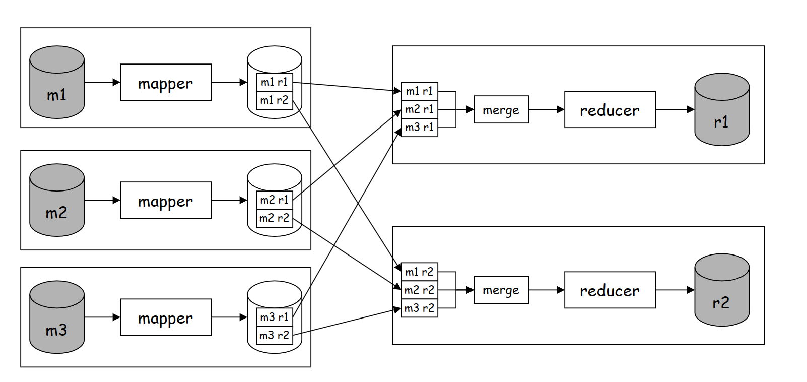
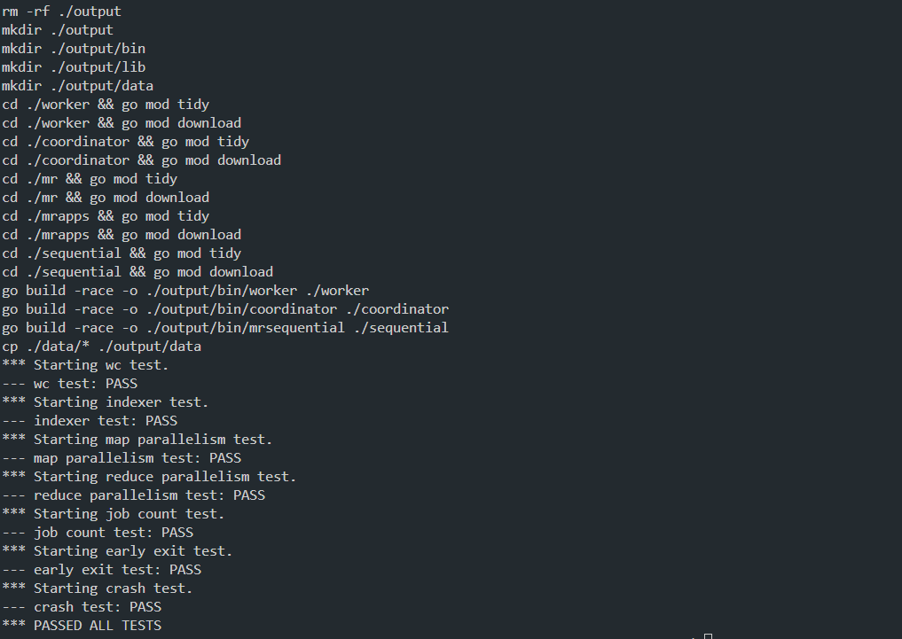

# MapReduce

[lab1](https://pdos.csail.mit.edu/6.824/labs/lab-mr.html)要求实现一个单机版的[MapReduce](https://pdos.csail.mit.edu/6.824/papers/mapreduce.pdf)框架。

## 原理
在实际应用中，我们经常需要处理K\V的任务，比如

- 根据服务器日志计算前K个最受欢迎的网页（url），输入是日志文件的每一行，输出是\<url, frequency\>
- 生成倒排索引，输入是关键字和文档ID，\<key word, doc id\>，输出是关键字和包含该关键字的文档列表，\<key word, list\<doc id\>\>

这些任务逻辑尽管非常简单，但是在输入达到一定规模的情况下，如何让计算时间在一个合理范围内是一个非常大的挑战。MapReduce是一个编程框架，通过切分大的数据将计算分布到多台机器上执行，每台机器上只会执行数据的一部分，提高计算的并行度降低任务的执行时间。在使用MapReduce时，需要提供两个函数
- Map：Map处理每个子集，生成中间数据，中间数据包括多个K\V
- Reduce：对于每个key，处理（合并）key对应的所有value，生成最终数据

MapReduce框架将数据切分成包含M个小文件的数据集，由M个mapper读取执行Map函数。每个mapper生成R个中间文件，中间文件是由多个K\V组成，mapper使用分区函数（partition）将K\V分布到R个中间文件中。每个reducer读取M个中间文件，合并M个中间文件使得同一个关键字的K\V能够连续出现，并将同一个关键字的所有value作为Reduce函数的参数调用Reduce函数，将Reduce函数的返回值写入到目的目录中（GFS）。如下图是一个包含3个mapper和2个reducer的MapReduce作业。


MapReduce框架需要提供任务调度和故障恢复的功能，因此需要提供一个作业管控服务来监控任务执行状态。在MapReduce作业执行期间，会有两种类型的进程存在：master和worker，master进程只会有一个，用于提供任务调度和故障恢复，worker进程包括多个，实际执行mapper和reducer。注意尽管这里使用进程来描述master和worker，但在生产环境中，master进程和worker进程是分布在多台机器中的。

master进程是一个有状态的服务，跟踪mapper或者reducer的执行状态（idle、in-progress、completed）、worker进程id（执行任务的机器标识符）。对于已经完成的mapper，master还需要记录中间文件位置和大小来告知reducer读取中间文件。worker进程是一个无状态服务，接收master分配任务的请求，在执行完后通知master获取执行结果。

故障恢复需要应对master进程故障和worker进程故障，接下来针对这两种故障展开讨论。
- master进程和worker进程维护心跳，当某个worker进程心跳超时，master进程会重新调度该worker进程正在执行的mapper或者reducer，对于已经执行完的mapper，由于worker进程故障导致中间数据不可读，因此已经执行完的mapper也需要再次调度重新执行，而已经完成reducer不需要重新调度，这是因为reducer的输出是在分布式文件系统（GFS）中。针对mapper被调度多次的情况，reducer如果已经读取完之前某次的中间数据，那么会忽略后面由于故障再次调度mapper产生的中间数据。
- master进程发生故障有两种手段处理。第一种方法是为master进程定期将状态写入快照中，当master进程故障可以从最新快照恢复，第二种方法比较暴力，直接终止整个MapReduce作业，并报告故障。

故障恢复会伴随着一致性的问题，也就是MapReduce作业的最终输出能否和顺序执行保持一致。由于worker进程故障导致mapper或者reducer重复执行是否会影响一致性。对于确定性的Map函数或者Reduce函数，确定性意味着同样的输入Map函数和Reduce函数总能够产生一样的输出，那么mapper的重复执行总能够产生一样的数据，同样对于重复执行的reducer由于中间数据一样，也能够产生一样的输出。反之，对于不确定性的Map函数或者Reduce函数，MapReduce框架只能提供一种较弱的一致性语义，对于单个reducer的输出总能够和顺序执行保持一致，而对于不同的reducer由于mapper重复执行导致读取的中间数据是不同时间节点产生的，因此不同的reducer输出不能和顺序执行保持一致。如下图，包含一个mapper和2个reducer的MapReduce作业，mapper 1发生三次重试，由于reducer的输出总是在所有mapper执行完后才会产生，因此一个reducer的输出和顺序执行保持一致，但是不同的reducer会有一致性问题，下图中reducer 1在mapper 1第二次重新执行后完成，而reducer 2的中间数据和reducer 1的中间数据是mapper 1不同重试产生的，因此reducer 2读取的中间数据产生时间点晚于reducer 1读取的中间数据导致和顺序执行发生不一致。


论文中提了两点很重要的优化。MapReduce框架数据是通过网络传输的，因此带宽可能会是性能瓶颈，将计算靠近数据可以尽量避免数据通过网络传输。比如将mapper分配输入数据同一机器的worker进程，能够只需要读取本地磁盘避免通过网络传输数据，提高数据的局部性。在MapReduce作业快要执行完时，由于部分较慢的机器拖慢了整个MapReduce作业的执行。MapReduce框架可以提供backup机制使用较少的计算资源加速MapReduce作业的执行。

## 实现

### 存储
MapReduce框架会对输入数据按照固定大小切分包含多个小文件的数据集，这是依赖GFS做的，GFS会将一个大文件以固定大小的chunk为单位存储。对于lab1，输入数据包含多个文件，并且文件较小，因此可以以文件为粒度执行mapper，每个mapper读取一个文件。

尽管数据是存放在本地文件系统下的，但为了完整性，我们还是对存储层进行了抽象，并基于[os包](https://pkg.go.dev/os@go1.22.3)提供了本地文件系统的实现，详情可以见[代码](mr/fs/local_fs.go)。

### worker

worker是执行mapper和reducer的实体，尽管mapper和reducer会输出数据，但是worker本身是无状态的服务，这是因为对于mapper，master会重试故障worker执行的mapper，对于reducer，数据会写入高可用的分布式文件存储中。

worker需要做的事情包括四个
- 执行master分配的mapper或者reducer任务
- 响应master的心跳包，并汇报worker任务执行情况
- 响应worker读取中间数据的请求
- master通知worker中间数据的位置信息

worker需要提供如下RPC接口，参数定义见[这里](./mr/rpc/rpc.go)，前四个接口分别对应上述四点，第五个接口是master通知worker可以释放资源，进程可以推出了。

```golang
func (w *Worker) Assign(args *rpc.AssignArgs, reply *rpc.AssignReply) error
func (w *Worker) Heartbeat(args *rpc.HeartbeatArgs, reply *rpc.HeartbeatReply) error
func (w *Worker) Read(args *rpc.ReadArgs, reply *rpc.ReadReply) error
func (w *Worker) Notify(args *rpc.NotifyArgs, reply *rpc.NotifyReply) error
func (w *Worker) Destroy(args *rpc.DestroyArgs, reply *rpc.DestroyReply) error
```

`Assign`处理master的任务分配请求，`args`中包括任务类型、输入数据以及输出位置等信息，worker创建goroutine执行任务。对于mapper类型的任务，worker读取文件所有内容到内存中，并调用Map函数。Map函数执行完后，首先将`[]KeyValue`排序，接下来对于每个`KeyValue`根据分区函数将`KeyValue`写入到本地磁盘中。整体逻辑相比较论文简化了很多：
- 论文中使用流式读取文件，避免文件过大无法加载到内存中
- 论文中通过`Emit`将`KeyValue`通知给MapReduce框架，框架负责在内存维护有序的数据结构，磁盘维护一个有序表，一旦内存的有序表满了，会和磁盘的有序表进行归并，生成一个新的有序表文件，避免文件过大生成的`KeyValue`占用太多内存
- 论文中引入了combine阶段，可以将中间数据相同的key进行合并，减少中间数据的大小从而减少网络中传输的数据量

```golang
func Map(filename string, content string) []KeyValue
```

对于reducer类型的任务，只有第一个mapper任务执行完后才会启动并读取中间文件的数据，执行Reduce函数。Reduce函数每次处理一个key，因此只有所有mapper任务执行完后，才能够完整到读取一个key的所有value。在实现上，我们对worker的`Read`rpc接口使用迭代器封装，并且能够从迭代器中读到一个`KeyValue`，当mapper重复执行后，更新迭代器中间文件位置信息，这样迭代器下次读取的时候可以从新的中间文件读取了。具体实现见[代码](./mr/worker/iterator.go)。

```golang
func Reduce(key string, values []string) string
```

### master
lab1中使用coordinator表示master，为了和前文一致，我们这里依旧使用master阐述实现逻辑。

master作为调度任务和管理worker的中心节点，需要做的事情包括
- 服务发现，能够自动找到存活的worker进程
- 调度任务，master有能力将任务均衡地调度到所有worker
- 发现异常worker并将异常worker从集群中摘除
- 收集mapreduce作业运行状态

lab1中master提供一个供worker注册地接口来实现服务发现，当worker进程启动会首先调用注册接口，接下来该worker就注册到集群了，可以被master分配任务。

```golang
func (c *Coordinator) Register(args *rpc.ReadArgs, reply *rpc.ReadReply) error
```

对于任务的调度，master对于每个worker正在执行的任务都做了限制，这样随着worker依次注册，那么不会导致所有任务都分配到第一个注册的worker上执行。master需要做好故障处理，当worker异常，master有能力将该worker正在执行的任务和已经执行完的mapper调度到正常的worker上，这个问题尽管看起来很简单，但是由于我们限制了每个worker执行的任务数，那么如果所有worker都达到了限制，这些由于异常导致的任务就无法执行了，有可能让整个mapreduce作业阻塞。举个例子，假设mapreduce作业mapper和reducer各有四个，有四个worker，每个worker都分配了2个任务，由于reducer需要在所有mapper至少都执行完一次后才有可能成功执行。现在挂了两个worker，并且执行的都是mapper类型任务，这就导致所有reducer无法进一步执行，mapper任务又无法调度，整个mapreduce作业发生阻塞。要解决这个问题，简单粗暴的方法就是对于mapper类型可以放行，可以突破单个worker执行任务的上限，更精细的方法，是能够检测出上述描述的case，也就是所有mapper都是IDLE。简单考虑，我们采用简单粗暴却有效的方法:）。

## 执行
在lab根目录下执行`bash test-mr.sh`

`test-mr.sh`包含两个参数：第一个参数表示是否需要静默输出，如果第一个参数是`quiet`，那么会静默coordinator或者worker的输出；第二个参数如果没有指定那么会执行`make`编译。

`test-mr-many.sh`是多次执行test-mr.sh。附上全部pass的截图：



## 总结
以上就是我在实现lab1：MapReduce过程的总结，开发加debug约花了10h。
