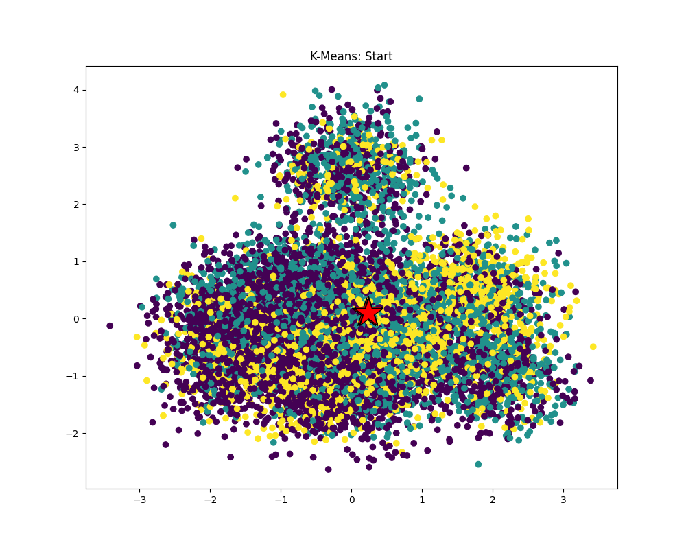
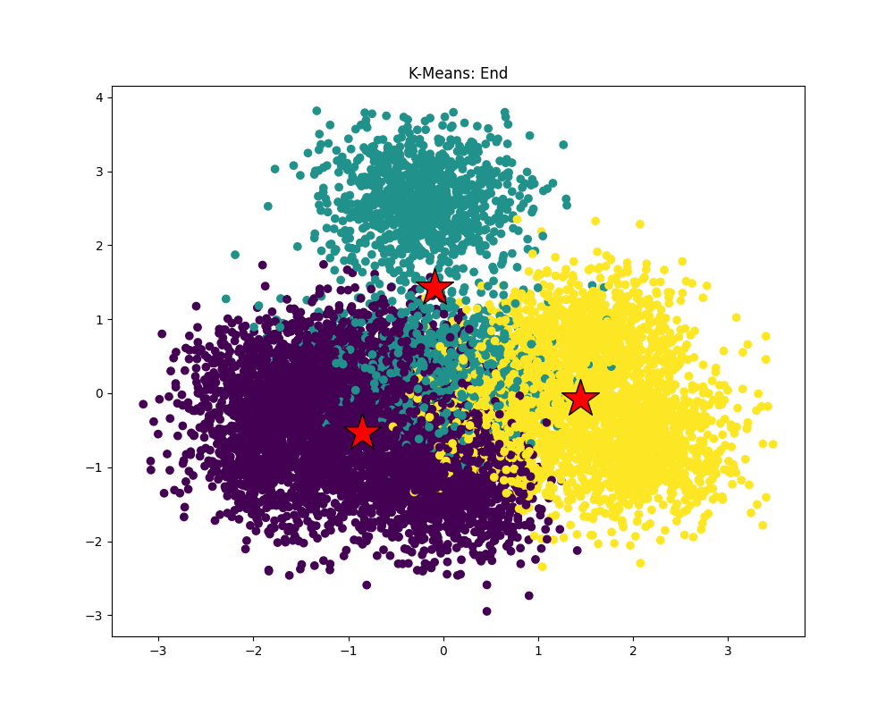

# Solution

## Q1

```
Running K-means with: M=1000000, N=100, K=3, epsilon=0.100000
[Total Time]: 4826.603 ms
```

## Q2





## Q3

| function | time (ms) |
| --- | --- |
| computeAssignments | 7437.790 |
| computeCentroids | 427.045 |
| computeCost | 2488.081 |
| dist | 7558.491 |
| total | 11178.869 |

## Q4

热点函数为dist，因此优化目标为dist

```c
__m256d sum = _mm256_setzero_pd();
for (int i = 0; i < nDim; i += 4) {
  __m256d X = _mm256_load_pd(x + i);
  __m256d Y = _mm256_load_pd(y + i);

  __m256d diff = _mm256_sub_pd(X, Y);
  __m256d sq = _mm256_mul_pd(diff, diff);
  sum = _mm256_add_pd(sum, sq);
} 

double result[4];
_mm256_storeu_pd(result, sum);
return sqrt(result[0] + result[1] + result[2] + result[3]); 
```

| function | time (ms) |
| --- | --- |
| computeAssignments | 4532.751 |
| computeCentroids | 415.666 |
| computeCost | 1461.978 |
| dist | 3556.433 |
| total | 7274.966 |

将所有日志去掉，提升了1.5倍

```
Running K-means with: M=1000000, N=100, K=3, epsilon=0.100000
[Total Time]: 3162.110 ms
```