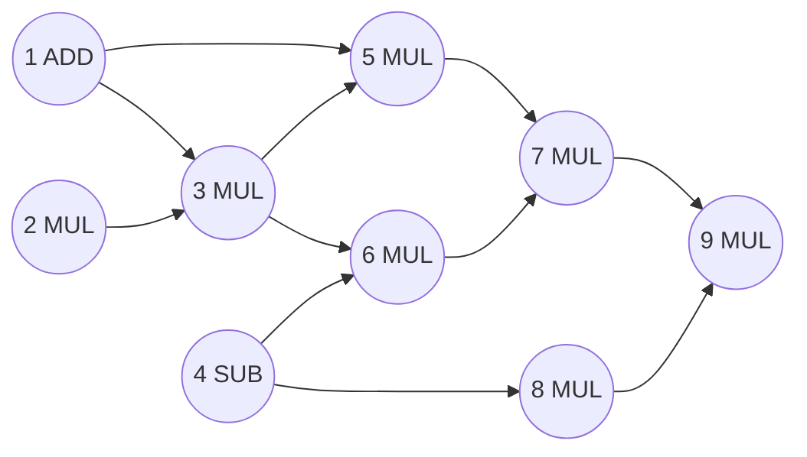
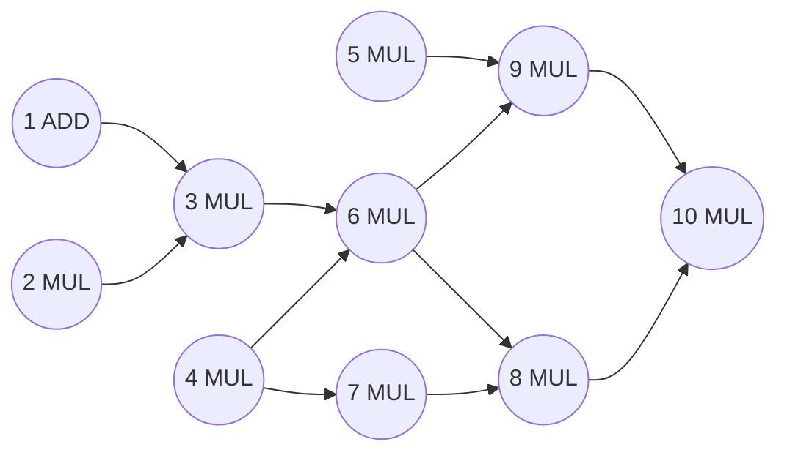

## Problem 1

### A

$$
\begin{aligned}
FLOPS &= freq. \times cycle \times cores \\
&= 1B \times 1 \times 3 \\
&= 3B
\end{aligned}
$$

### B
$$
\begin{aligned}
FLOPS &= freq. \times cycle \times SIMD \times cores \\
&= 1B \times 1 \times 8 \times 3 \\
&= 24B
\end{aligned}
$$

### C
$$
\begin{aligned}
FLOPS &= freq. \times HW \times cycle \times SIMD \times cores \\
&= 1B \times 4 \times 1 \times 8 \times 3 \\
&= 96B
\end{aligned}
$$

### D
$$
\begin{aligned}
FLOPS &= (3B + 24B) \times  \\
&= 108B
\end{aligned}
$$

## Problem 2

### A

### B

支持三路超标量的处理器执行上述指令流，其中
- MUL: 需要2个周期
- ADD: 需要一个周期

```mermaid
%%{init: { 
  'gantt': { 
    'topAxis': true,
    'displayMode': 'compact',
    'tickInterval': '1s'
  } 
} }%%
gantt
    title CPU Core1 指令执行流
    dateFormat ss
    axisFormat C%S
    
    section Stream 1
        ADD 1 :active, a1, 00, 01s
        MUL 3 :active, a1, 02, 02s
        MUL 6 :active, a1, 04, 02s
        MUL 10:active, a1, 08, 02s

    section Stream 2
        MUL 2 :active, a1, 00, 02s
        MUL 5 :active, a1, 02, 02s
        MUL 9 :active, a1, 04, 02s

    Section Stream 3
        MUL 4 :active, a1, 00, 02s
        MUL 7 :active, a1, 02, 02s
        MUL 8 :active, a1, 06, 02s
```

### C

如果改成5路并行，那么指令级并行(ISP)可以是执行的可能顺序如下图，由于指令之间有依赖，因此最优执行仍然是10周期。

```mermaid
%%{init: { 
  'gantt': { 
    'topAxis': true,
    'displayMode': 'compact',
    'tickInterval': '1s'
  } 
} }%%
gantt
    title CPU Core1 指令执行流
    dateFormat ss
    axisFormat C%S
    
    section Stream 1
        ADD 1 :active, a1, 00, 01s
        MUL 3 :active, a1, 02, 02s
        MUL 6 :active, a1, 04, 02s
        MUL 8 :active, a1, 06, 02s
        MUL 10:active, a1, 08, 02s
        

    section Stream 2
        MUL 2 :active, a1, 00, 02s
        MUL 9 :active, a1, 04, 02s

    Section Stream 3
        MUL 4 :active, a1, 00, 02s
        

    Section Stream 4
        MUL 5 :active, a1, 00, 02s
        

    Section Stream 5
        MUL 7 :active, a1, 02, 02s
```

## Problem 3
### A

总共10名助教批改试卷，试卷包含7道题，其中
- Q1花费一个助教三分钟的时间
- Q2 - Q7花费一个助教一分钟的时间

现在把10名助教分成7个team
- 2名助教批改Q1
- 3名助教批改Q2
- Q3-Q7由剩余的5名助教分别批改

流水线最慢的环节是Q1，总共两名助教，每1.5分钟批改完，因此每1.5分钟可以批改完一套试卷，吞吐为0.67套/分钟。

### B
每份试卷的批改时间为$3 + 6 \times 1 = 9$分钟

## Problem 4
### A
- 单个核心包含两个硬件上下文
- 浮点数运算需要一个周期
- cacheline大小为4字节
- cache大小16mb
- 访存延迟为50周期
- cache命中load为0周期
- 存储延迟为0周期

每次处理一个cacheline(4字节)，需要的周期数为

$$
50 (load) + 10(FLOP) + 0(store) = 50 + 10 = 60
$$

每个线程发生cache miss时，都会切换到另外一个thread执行，在执行完10个cycle后，切回到原来的thread继续执行，由于cache miss的处理需要50个周期，因此此时CPU stall了40个周期。综上所述，每50个cycle，只有10个cycle在执行指令，CPU的利用率为20%。

### B
在这个场景内（访存延迟远远大小计算时间），增加CPU核心频率无法解决问题，只有降低访存延迟才可以增加CPU的利用率。

## Problem 5
### A
- 如果全1，那么处理4个浮点数需要1个周期
- 如果全0，那么处理4个浮点数需要10个周期
- 如果既有0，也有1，那么处理4个浮点数需要11个周期

每13行中

- 包含4行，包含1个全0的cell，和3个全1de cell，因此需要$ 1 \times 10 + 3 \times 1 = 13 $个周期
- 包含9行，包含2个全0的cell，和2个既有0也有1的cell，因此需要$ 2 \times 10 + 2 \times 11 = 42 $个周期

因此总需要$55N$个周期

### B
- 当4个浮点数值都相等时，那么SIMD的效率为100%
- 当4个浮点数值不相等时，那么SIMD的效率为

    $$
    \frac{N_0 \times 10 + N_1 \times 11}{42}
    $$

因此，有4行的SIMD效率为100%，剩余的9行，既有0也有1的cell，包含8个数字，这8个数字的效率为

$$
\frac{4 \times 10 + 4 \times 11}{88} = 50\%
$$

因此总共的效率为75%

综上所述

$$
4 \div 13 + 9 \div 13 \times 0.5 = 0.65
$$