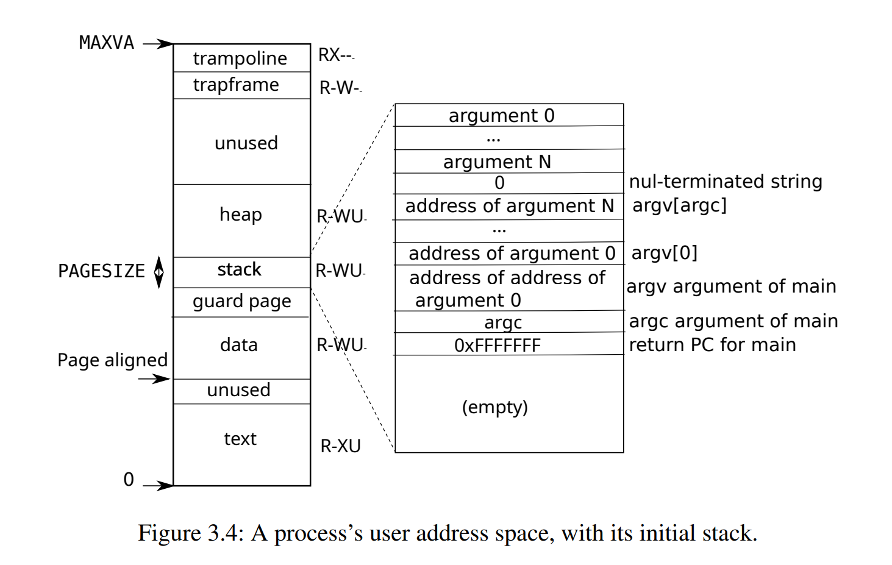

# lab02

## Q&A

### 1. Looking at the backtrace output, which function called syscall?


`a7`寄存器的值为7，通过查看[syscalls表](https://github.com/mit-pdos/xv6-riscv/blob/riscv/kernel/syscall.c#L107)可以判断当前系统调用为`exec`。

其次，也可以通过[user/initcode.S](https://github.com/mit-pdos/xv6-riscv/blob/riscv/user/initcode.S#L11)得出系统调用为`exec`，xv6-riscv第一个进程为`initcode`，会执行`ecall`指令触发`Environment call from U-mode`异常陷入内核，执行[`usertrap`](https://github.com/mit-pdos/xv6-riscv/blob/riscv/kernel/trap.c#L53)调用请求的系统调用。

### 2. What is the value of p->trapframe->a7 and what does that value represent?

`p->trapframe`为物理地址，这意味只能在S-mode下才能访问，在创建进程时通过虚拟地址将`p->trapframe`映射到user space下，如下图所示。当进程执行系统调用时，会将参数放到a0-a6中，并且将系统调用索引放到寄存器a7中，随后执行[`ecall`指令](https://github.com/mit-pdos/xv6-riscv/blob/riscv/user/initcode.S#L17)，该指令会触发`Environment call from U-mode`异常，从而陷入内核态（S-mode），执行保存在`sepc`寄存器的handler —— [uservec](https://github.com/mit-pdos/xv6-riscv/blob/riscv/kernel/trampoline.S#L21)，将页表寄存器`satp`设置为内核空间的[页表](https://github.com/mit-pdos/xv6-riscv/blob/riscv/kernel/vm.c#L12)，接着调用[c代码](https://github.com/mit-pdos/xv6-riscv/blob/riscv/kernel/trap.c#L37)，最后通过`scause`寄存器中的异常原因决定调用[`syscall()`](https://github.com/mit-pdos/xv6-riscv/blob/riscv/kernel/syscall.c#L132)，`syscall()`是一个dispatcher，根据`p->tramframe->a7`路由到对应的系统调用。



### 3. What was the previous mode that the CPU was in?
如下图所示，`sstatus`寄存器描述`S-mode`的中断或者异常的状态。其中`sstatus.SSP`表示从什么特权模式中进入`S-mode`的，通过打印`p/x $sstatus`，得到`sstatus=0`。


RISC-V架构下总共包含三种特权模式，二进制表示如下，由于`sstatus.SPP=0`，因此是从U-mode进入S-mode的。

|特权模式|二进制|
|:-:|:-:|
|00|U-mode|
|01|S-mode|
|11|M-mode|

### 4. Write down the assembly instruction the kernel is panicing at. Which register corresponds to the variable num?

```
B+>0x80002050 <syscall+20> lw      a3,0(zero) # 0x0
```
因此寄存器`a3`保存变量`num`。

### 5. Why does the kernel crash?
通过将[`syscall()`](https://github.com/mit-pdos/xv6-riscv/blob/riscv/kernel/syscall.c#L137)替换为`num = * (int *) 0;`，在执行`make qemu`后，会发生如下panic

```
scause 0x000000000000000d
sepc=0x0000000080002050 stval=0x0000000000000000
panic: kerneltrap
```
其中`scause=13`表示发生`Load page fault`异常，这就表示访问的地址是无效的，通过内核的地址空间可以确定`0x1`是没有做任何映射的，因此`PTE.V=0`表示是无效地址。


### 6. What is the name of the binary that was running when the kernel paniced? What is its process id (pid)?

内核crash是由于`pid=1`，name为`initcode`的进程调用`exec`系统调用导致的。

## trace

`trace`系统调用需要跟踪进程的系统调用，每次执行一次系统就打印一条日志。在XV6操作系统下，`trace`原型如下

```c
int trace(int mask);
```

`mask`参数用于表示需要跟踪的系统调用，每个系统调用都有一个系统调用号，定义在[kernel/syscall.h](https://github.com/mit-pdos/xv6-riscv/blob/riscv/kernel/syscall.h)中，对于调用号为`x`的系统调用，如果需要跟踪，那么`mask |= 1 << x`。

通过在`struct proc`增加`tmask`字段，当调用`trace`时会设置该字段为参数`mask`。随后在执行系统调用时会进入[`syscall()`](https://github.com/mit-pdos/xv6-riscv/blob/riscv/kernel/syscall.c#L137)，在`syscall()`中打印相应日志实现跟踪系统调用的效果。

```c
if(num > 0 && num < NELEM(syscalls) && syscalls[num]) {
  // Use num to lookup the system call function for num, call it,
  // and store its return value in p->trapframe->a0
  p->trapframe->a0 = syscalls[num]();
  if (p->tmask & (1<<num)) {
    printf("%d: syscall %s -> %d\n", p->pid, syscall_name[num], p->trapframe->a0);
  }
}
```

需要注意的是，`trace`也需要跟踪子进程的系统调用，因此当执行`fork`创建子进程时，子进程需要将父进程的`tmask`复制到其进程结构体`struct proc`中。

```c
np->tmask = p->tmask;
```

## sysinfo

`sysinfo`系统调用可以获取系统的空闲内存大小和运行进程数量，其函数原型为

```c
struct sysinfo {
  uint64 freemem;   // amount of free memory (bytes)
  uint64 nproc;     // number of process
};

int sysinfo(struct sysinfo*);
```

QEMU模拟的RISC-V平台物理内存大小为128mb，XV6使用在初始化时会将内存按页划分并使用单链表`freelist`维护所有可用页，因此可以通过`freelist`大小来获取空闲内存大小

```c
uint64 
kmemfree(void)
{
  uint64 bytes;
  struct run* r;

  bytes = 0;
  acquire(&kmem.lock);
  r = kmem.freelist;
  for (;r; r = r->next) {
    bytes += PGSIZE;
  }
  release(&kmem.lock);
  return bytes;
}
```

XV6内核有个`struct proc proc[NPROC]`数组来表示所有进程，通过遍历`proc`数组即可获取运行进程数量

```c
uint64
procnum(void)
{
  struct proc *p;
  uint64 num;

  num = 0;
  for (p = proc; p < &proc[NPROC]; p++) {
    acquire(&p->lock);
    if (p->state != UNUSED) {
      num++;
    }
    release(&p->lock);
  }  
  return num;
}
```

另外需要注意的是，`sysinfo`系统调用会传入用户空间下的地址，这个地址由于根页表寄存器`satp`已经被设置为内核的页表，因此在内核空间下无法访问该地址。XV6内核提供一个函数`copyout`可以将内核地址空间的数据拷贝到用户态下，函数原型为

```c
/**
 * dstva：虚拟地址，可以通过pagetable来查找PTE找到物理地址
 * src：需要拷贝到dstva的数据
 * len：需要拷贝到dstva的数据长度
 */
int copyout(pagetable_t pagetable, uint64 dstva, char *src, uint64 len);
```
