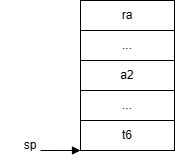

# lab06

## uthread
这个任务的目标是在一个进程中实现指令流切换的功能，最主要的事情是实现`yield`或者`switch`保存当前指令流的上下文，并且切换到目标指令流上下文。



```asm
thread_switch:
    /* save register to stack */
	addi 	sp, sp, -224
	sd		ra, 216(sp)
	sd 		gp, 208(sp)
    sd 		tp, 200(sp)
    sd 		t0, 192(sp)
    sd 		t1, 184(sp)
    sd 		t2, 176(sp)
    sd 		s0, 168(sp)
    sd 		s1, 160(sp)
    sd 		a2, 152(sp)
    sd 		a3, 144(sp)
    sd 		a4, 136(sp)
    sd 		a5, 128(sp)
    sd 		a6, 120(sp)
    sd 		a7, 112(sp)
    sd 		s2, 104(sp)
    sd 		s3, 96(sp)
    sd 		s4, 88(sp)
    sd 		s5, 80(sp)
    sd 		s6, 72(sp)
    sd 		s7, 64(sp)
    sd 		s8, 56(sp)
    sd 		s9, 48(sp)
    sd 		s10, 40(sp)
    sd 		s11, 32(sp)
    sd 		t3, 24(sp)
    sd 		t4, 16(sp)
    sd 		t5, 8(sp)
    sd 		t6, 0(sp)

	sw 		sp, 0(a0)       /* write sp to first parameter */

    /* restore register of new thread */
	ld		t6,	0(a1)
	ld		t5,	8(a1)
	ld		t4,	16(a1)
	ld		t3,	24(a1)
	ld		s11, 32(a1)
	ld		s10, 40(a1)
	ld		s9, 48(a1)
	ld		s8, 56(a1)
	ld		s7, 64(a1)
	ld 		s6, 72(a1)
	ld 		s5, 80(a1)
	ld 		s4, 88(a1)
	ld 		s3,	96(a1)
	ld 		s2, 104(a1)
	ld 		a7, 112(a1)
	ld 		a6, 120(a1)
	ld 		a5, 128(a1)
	ld 		a4, 136(a1)
	ld 		a3, 144(a1)
	ld 		a2, 152(a1)
	ld 		s1, 160(a1)
	ld 		s0, 168(a1)
	ld 		t2, 176(a1)
	ld 		t1, 184(a1)
	ld 		t0, 292(a1)
	ld 		tp, 200(a1)
	ld 		gp, 208(a1)
	ld		ra, 216(a1)

	addi	sp, a1, 224     /* restore sp */

	ret    /* return to ra */
```

`thread_switch`的函数原型为

```
void thread_switch(uint64, uint64);
```
第一个参数是值参数，`thread_switch`会将当前指令流的`sp`值写入其中，第二个参数是待执行的指令流栈顶指针。

在`struct thread`中新增字段`sp`为`thread_switch`的参数

```c
struct thread {
    ...
    char        *sp;
};
```

调用`thread_create`是初始化`sp`字段

```c
void 
thread_create(void (*func)())
{
    ...
    t->sp = t->stack + STACK_SIZE - 224; 
    *((uint64*)(t->stack + STACK_SIZE) - 1) = (uint64)func; // ra = func
}
```

最后只需要在`thread_schedule`中调用`thread_switch`即可

```c
void 
thread_schedule(void)
{
    ...
    if (current_thread != next_thread) {         /* switch threads?  */
        next_thread->state = RUNNING;
        t = current_thread;
        current_thread = next_thread;
        thread_switch((uint64)&t->sp, (uint64)current_thread->sp);
    } else
        next_thread = 0;
}
```

## using threads

任务目标是熟悉`pthread_xxx`函数的用法。实现一个并发安全的哈希表，可以通过在外围加一个`pthread_mutex_t`来保护避免多个进程\线程写入，但是这种做法比较低效，可以通过减小锁的粒度来减小临界区的大小。将每个`bucket`都有一个自己独立的锁，从而每个`bucket`都能够并行读写。

## barier

```c
static void 
barrier()
{
    pthread_mutex_lock(&bstate.barrier_mutex);
    bstate.nthread++;
    if(bstate.nthread < nthread) {
        pthread_cond_wait(&bstate.barrier_cond, &bstate.barrier_mutex);
    } else {
        bstate.nthread = 0;
        bstate.round++;
        pthread_cond_broadcast(&bstate.barrier_cond);
    }
    pthread_mutex_unlock(&bstate.barrier_mutex);
}
```