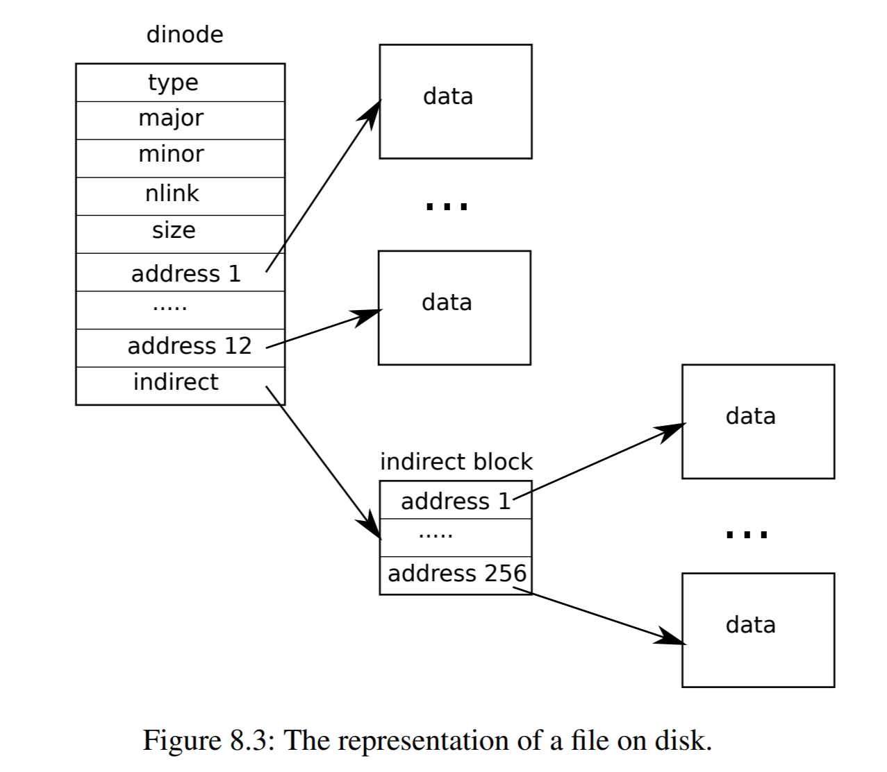
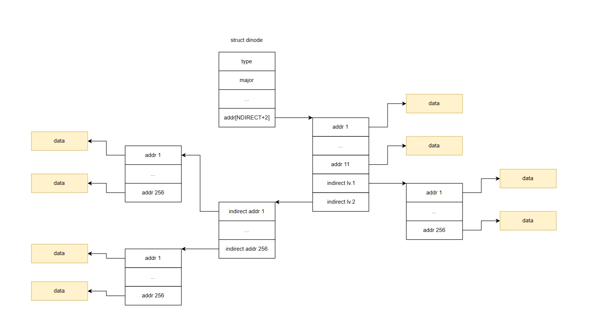

# lab09: file system

## large file

`xv6`文件最大为`12+256`个block，其中256个block为间接索引。


本实验扩展`xv6`，实现更大文件的写入，但是不能修改磁盘的inode结构，因此通过增加二级索引来实现更大的文件。



首先修改[`fs.h`](https://github.com/mit-pdos/xv6-riscv/blob/riscv/kernel/fs.h#L27)一些宏定义，由于修改了`NDIRECT`，因此也需要修改`struct dinode`和`struct inode`。

```c
#define NDIRECT 11
#define NINDIRECT (BSIZE / sizeof(uint))              // 256
#define DNINDIRECT (NINDIRECT * NINDIRECT)            // 65536
#define MAXFILE (NDIRECT + NINDIRECT + DNINDIRECT)    // 65803

// On-disk inode structure
struct dinode {
    ...
    uint addrs[NDIRECT+2];   // Data block addresses
    
};

struct inode {
    ...
    uint addrs[NDIRECT+2];
};
```

接下来修改[`bmap`](https://github.com/mit-pdos/xv6-riscv/blob/riscv/kernel/fs.c#L383)函数就完成该实验了。

```c
#define IX(bn, lvl) (((bn) >> (8*lvl)) & 255)

static uint
bmap(struct inode *ip, uint bn)
{
    ...
    bn -= NINDIRECT;

    if(bn < DNINDIRECT){
        a = ip->addrs;
        bp = 0;
        for(int i = 2, ix = NDIRECT + 1; i >= 0; i--, ix=IX(bn, i)){
            addr = a[ix];
            if(addr == 0){
                addr = balloc(ip->dev);
                if(addr == 0)
                    return 0;
                a[ix] = addr;
                if(bp)
                    log_write(bp);
            }
            if(bp)
                brelse(bp);
            bp = bread(ip->dev, addr);
            a = (uint*)bp->data;
        }
        brelse(bp);
        return addr;
    }
    ...
}
```

## symbolic link
为`xv6`实现符号链接（symbolic link）。

创建符号链接的步骤十分关键：

1. 创建新的inode
2. 将目标路径写入新的inode
3. 更新父目录

更新父目录放在最后的原因是方便，否则不论是创建新的inode失败还是写入新的inode失败，都要更新父目录。

```c
uint64
sys_symlink(void)
{
    char target[MAXPATH], path[MAXPATH], name[DIRSIZ];
    struct inode *ip, *dp;
    short major, minor;

    if(argstr(0, target, MAXPATH) < 0 || argstr(1, path, MAXPATH) < 0)
        return -1;

    // printf("DEBUG: create symbolic link %s => %s\n", path, target);  
    begin_op();
    if((dp = nameiparent(path, name)) == 0)
        goto fail;
    ilock(dp);
    if((ip = ialloc(dp->dev, T_SYMLINK)) == 0){
        iunlockput(ip);
        end_op();
        return -1;
    }
    major = dp->major;
    minor = dp->minor;
    iunlock(dp);
    ilock(ip); 
    ip->major = major;
    ip->minor = minor;
    ip->nlink = 1;
    ip->size = 0;
    iupdate(ip);
    if(writei(ip, 0, (uint64)target, 0, strlen(target)) != strlen(target)){
        iput(dp);
        goto unlockip;
    }
    iunlock(ip);
    ilock(dp);
    if(dirlookup(dp, name, 0) != 0)
        goto unlockdp;
    if(dirlink(dp, name, ip->inum) != 0)
        goto unlockdp;
    iunlockput(dp);
    iput(ip);
    end_op();
    return 0;

unlockdp:
    iunlockput(dp);
    ilock(ip);
unlockip: 
    ip->nlink = 0;
    iupdate(ip);
    iunlockput(ip);
fail:
    end_op();
    return -1;
}

uint64
sys_open(void)
{
    ...
      depth = 0;
    while(ip->type == T_SYMLINK && (omode & O_NOFOLLOW) == 0 && depth <= 10){
        if(readi(ip, 0, (uint64)path, 0, MAXPATH) < 0){
            iunlockput(ip);
            end_op();
            return -1;
        }
        iunlockput(ip);
        if((ip = namei(path)) == 0){
            end_op();
            return -1;
        }
        ilock(ip);
        if(ip->type == T_DIR && omode != O_RDONLY){
            iunlockput(ip);
            end_op();
            return -1;
        }
        depth++;
    }
    if(depth > 10){
        iunlockput(ip);
        end_op();
        return -1;
    }
    ...
}
```