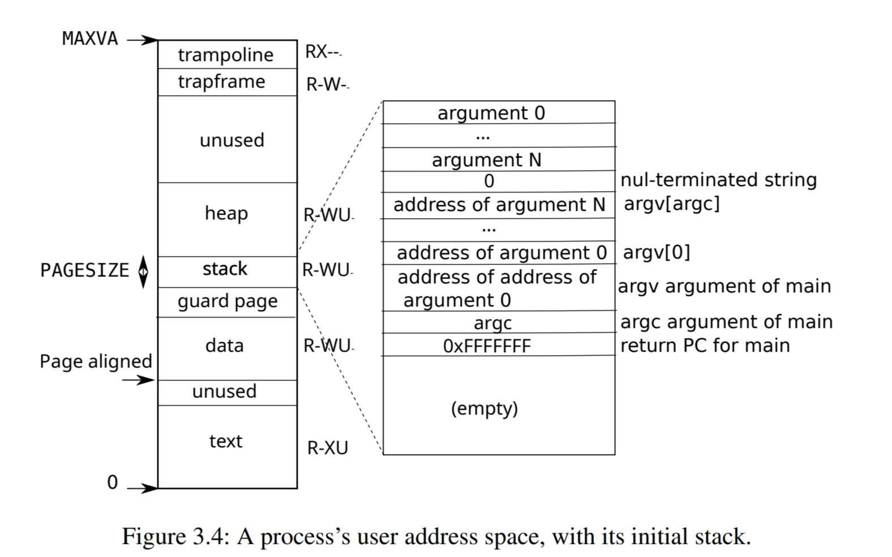

# lab: mmap

该lab要求实现`mmap`和`munmap`两个系统调用，允许将文件映射到进程的虚拟地址空间中。lab要求能够实现懒加载，意味着当读写映射的虚拟内存区域VMA（virtual memory area）发生缺页异常时才会真正将文件内容读取到实际的物理内存中，并将物理内存映射到进程的pagetable。

## mmap

`mmap`的函数原型如下，该lab忽略`addr`参数，其中`len`表示映射的VMA大小，必须是页大小的整数倍；`prot`参数是位参数，描述VMA的权限位
    - PROT_READ：VMA允许读
    - PROT_WRITE：VMA允许写入
    - PROT_EXEC：VMA允许执行（该lab没有用到）
`flags`也是位参数，描述VMA的属性
    - MAP_PRIVATE：VMA私有，这意味着写入只会在当前进程可见
    - MAP_SHARED：VMA共享，这意味着写入可以被其他进程看到，因此对于VMA的更新，会写入到文件中
`off`参数是文件的偏移量，本lab默认为0。

```c
uint64 mmap(uint64 addr, uint64 len, int prot, int flags, int fd, uint off);
```

由于是懒加载，因此`mmap`不需要读取数据，那么`mmap`的主要功能就是从进程的虚拟地址空间内找到一个空闲可用的区域，刚开始我的想法是类似于`sbrk`的实现，调整`p->sz`来实现，但是这会带来一个问题，`exit`是通过`p->sz`来释放进程的pagetable，也就是`exit`认为`p->sz`以下的空间都是已经映射到实际的物理页了，不允许存在空洞，那么`munmap`就无法真正释放空间了，只能通过调整PTE的权限位来避免进程访问，该方法尽管能够过了test，但是会存在大量垃圾数据只有等进程退出后才能释放。



另外一种更好的方案，vma的分配是在高地址空间下分配，在分配时从`trapframe`向下遍历找到能够至少分配`len`大小的vma。

```
maxva ----> +----------+
            |trampoline|
            +----------+
            |trapframe |
            +----------+
            |    vma   |
            +----------+
            |  unused  |
            +----------+
            |    vma   |
            +----------+
            |  unused  |
sbrk -----> +----------+
            |          |
            |    heap  |
            |          |
            +----------+
            |   stack  |
            +----------+
            |   guard  |
            +----------+
            |    data  |
            +----------+
            |  unused  |
            +----------+
            |    text  |
0 --------> +----------+
```
方案确定下来了，下面就可以具体的实现了。首先定义具体的`struct vma`，并且在`struct proc`中和`ofile`类似，也是用固定大小的数组来表示，如下，每个进程最多允许可以创建16个vma，其中`struct vma::addr`表示实际分配的vma的起始地址，该地址是在进程的虚拟地址空间内的，另外如果`struct vma::addr`为0表示为空闲的vma。

```c
struct file;
struct vma {
    uint64 addr;
    uint64 len;
    uint npages;          // Number of allocated physical pages
    int prot;
    int flags;
    uint filelen;         // Size of file when call mmap
    int roff;             // Read offset 
    int woff;             // Write offset
    struct file *file;
};

struct proc {
    ...
    struct vma vmas[16];         // Virtual memory area
    ...
};
```
通过定义`allocvma`函数来寻找一个可用的区域，寻找可用区域的算法是从进程的虚拟地址空间的最高地址开始找，直到找到一个至少为`len`大小的区域。
```c
// found an available area at least len bytes.
// case1: end - vend >= len
//         end        vend 
//          |          |
//    +-----+----------+-----+
//    | vma |          | vma |
//    +-----+----------+-----+
// case2: none of free areas has more than len bytes
//                    end
//                     |
//    +-----+----+-----+
//    | vma |    | vma |
//    +-----+----+-----+
static struct vma *
allocvma(struct proc *p, uint64 len)
{
  uint64 end, vend;
  int i;
  struct vma *v;

  v = 0;
  end = TRAPFRAME;
  for(i = 0; i < 16; i++){
    if(p->vmas[i].addr != 0){
      vend = p->vmas[i].addr + p->vmas[i].len;
      if(end - vend >= len)
        break;
      end = p->vmas[i].addr;
    } else if (v == 0) 
      v = &p->vmas[i];
  }
  if(v){
    v->addr = end - len;
    v->len = len;
  }
  return v;
}
```
实现了`allocvma`后，就能够很轻松地实现`mmap`函数了，注意需要调用`filedup`增加`struct file`的引用计数，避免`struct file`被释放。
```c
uint64
mmap(uint64 addr, uint64 len, int prot, int flags, 
     int fd, uint off)
{
    struct proc *p;
    struct file *f;
    struct vma *v;

    p = myproc();
    if(addr != 0 || len == 0 || fd < 0 || fd > NOFILE)
        return -1;
    if((f = p->ofile[fd]) == 0)
        return -1;
    // file is not writable but mmap needs to write file
    if(f->writable == 0 && ((flags & MAP_SHARED) && (prot & PROT_WRITE)))
        return -1;
    if((v = allocvma(p, len)) == 0)
        return -1;
    f = filedup(f);
    v->file = f;
    v->flags = flags;
    v->prot = prot;
    v->npages = 0;
    v->roff = 0;
    v->woff = 0;
    ilock(f->ip);
    v->filelen = f->ip->size;
    iunlock(f->ip);
    return v->addr;
}
```

## 处理缺页异常
由于`mmap`并没有实际读取文件内容映射到进程的虚拟地址空间内，因此当进程尝试读写`mmap`返回的虚拟地址会出现缺页异常，异常错误码为13（读取缺页异常）和15（写入缺页异常）。对于访问的是vma的虚拟地址，我们必须读取文件并且映射到虚拟地址空间内。

首先修改`fileread`和`filewrite`，类似Linux的`pread`和`pwrite`，支持指定`offset`来读取和写入，并且支持通过读写内核地址空间的数据。

```c
int
fileread(struct file *f, uint64 addr, int n, int user_dst, int off)
{
    int r = 0;
    uint offset;

    ...
    else if(f->type == FD_INODE){
        ilock(f->ip);
        offset = f->off;
        if(off >= 0)
            offset = off;
        if((r = readi(f->ip, user_dst, addr, offset, n)) > 0){
            if(off < 0) 
                f->off += r;
        }
        iunlock(f->ip);
  } 
  ...
}

int
filewrite(struct file *f, uint64 addr, int n, int user_src, int off)
{
    int r, ret = 0;
    uint offset;

    ...
    else if(f->type == FD_INODE){
        ...
        while(i < n){
            ...
            ilock(f->ip);
            offset = f->off;
            if(off >= 0)
                offset = off;
            if ((r = writei(f->ip, user_src, addr + i, offset, n1)) > 0){
                if(off >= 0)
                off += r;
                else
                f->off += r;
            }
            iunlock(f->ip);
            ...
        }
        ...
    }
    ...
}
```

接下来实现`cowvma`函数，`v->npages`表示已经读取的数据，`v->filelen`是文件的长度，`v->roff`表示读取的offset。`cowvma`会读取PGSIZE整数倍的数据，会读到至少包含`va`的数据量，并且将分配的物理页映射到进程的虚拟地址空间内。

```c
int
cowvma(uint64 va)
{
    struct proc *p;
    struct vma *v;
    int i, perm;
    void *mem;
    uint64 addr;
    uint bytes, len;

    p = myproc();
    v = 0;
    for(i = 0; i < 16 && v == 0; i++){
        if(p->vmas[i].addr != 0 && p->vmas[i].addr <= va && p->vmas[i].addr + p->vmas[i].len > va)
            v = &p->vmas[i];
    } 
    if(v == 0)
        return -1;
    addr = v->addr + v->npages * PGSIZE;
    bytes = 0;
    if(v->npages * PGSIZE < v->filelen)
        bytes = v->filelen - v->npages * PGSIZE;
    perm = PTE_U | PTE_V;
    if(v->prot & PROT_READ)
        perm |= PTE_R;
    if(v->prot & PROT_WRITE)
        perm |= PTE_W;
    if(v->prot & PROT_EXEC)
        perm |= PTE_X;
    for(; addr <= va; addr += PGSIZE){
        if((mem = kalloc()) == 0)
            return -1;
        memset(mem, 0, PGSIZE);
        len = PGSIZE;
        if(len > bytes)
            len = bytes;
        if(len){
            fileread(v->file, (uint64)mem, len, 0, v->roff);
            bytes -= len;
            v->roff += len;
        }
        mappages(p->pagetable, v->addr + v->npages * PGSIZE, 
                PGSIZE, (uint64)mem, perm);
        v->npages++;
    }

    return 0;
}
```

最后修改`usertrap`函数，当发生异常，并且`scause`为13或者15时调用`cowvma`处理异常。

```c
void
usertrap(void)
{
    ...
    else if(r_scause() == 15 || r_scause() == 13){
        if(cowvma(r_stval()) != 0){
            printf("usertrap(): unexpected scause %p pid=%d\n", r_scause(), p->pid);
            printf("            sepc=%p stval=%p\n", r_sepc(), r_stval());
            setkilled(p);
        }
    } 
    ...
}
```

## munmap
`munmap`需要实现功能
- 将映射的物理页释放，并且更新进程的pagetable
- 如果vma需要写入到文件，将分配到的物理页写入到文件中
- 如果vma整个区域都释放，那么释放vma

```c
int
munmap(uint64 addr, uint64 len)
{
    struct proc *p;
    struct vma *v;
    int i, npages;
    uint filelen;

    p = myproc();
    v = 0;
    for (i = 0; i < 16 && v == 0; i++){
        if(p->vmas[i].addr != 0 && p->vmas[i].addr == addr)
        v = &p->vmas[i];
    }
    if(v == 0)
        return -1;
    if(len > v->len)
        len = v->len;
    npages = len / PGSIZE;
    if(npages > v->npages)
        npages = v->npages;
    filelen = npages * PGSIZE;
    if(filelen > v->filelen)
        filelen = v->filelen;
    if((v->flags & MAP_SHARED) && filelen && (v->prot & PROT_WRITE)){
        if(filewrite(v->file, v->addr, filelen, 1, v->woff) != filelen)
            return -1;
    }
    uvmunmap(p->pagetable, addr, npages, 1);
    v->addr += len;
    v->len -= len;
    v->npages -= npages;
    v->filelen -= filelen;
    v->woff += filelen;
    if(v->len == 0){
        fileclose(v->file);
        v->addr = 0;
    }
    return 0;
}
```

## fork和exit

`fork`需要处理vma，将父进程的vma拷贝到子进程中，`exit`需要释放vma

```c
int
fork(void)
{
    ...
    for(i = 0; i < 16; i++)
        if(p->vmas[i].addr){
            filedup(p->vmas[i].file);
            memmove(&np->vmas[i], &p->vmas[i], sizeof(p->vmas[i]));
            np->vmas[i].roff -= np->vmas[i].npages * PGSIZE;
            if(np->vmas[i].roff < 0)
                np->vmas[i].roff = 0;
            np->vmas[i].npages = 0;
        }
    ...
}

void
exit(int status)
{
    ...
    for(struct vma *v = p->vmas; v < p->vmas + 16; v++){
        if(v->addr){
            munmap(v->addr, v->len);
            v->addr = 0;
        }
    }
    ...
}
```
